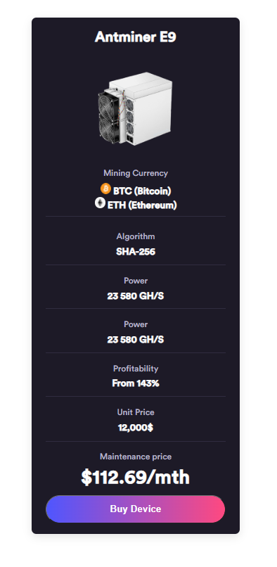
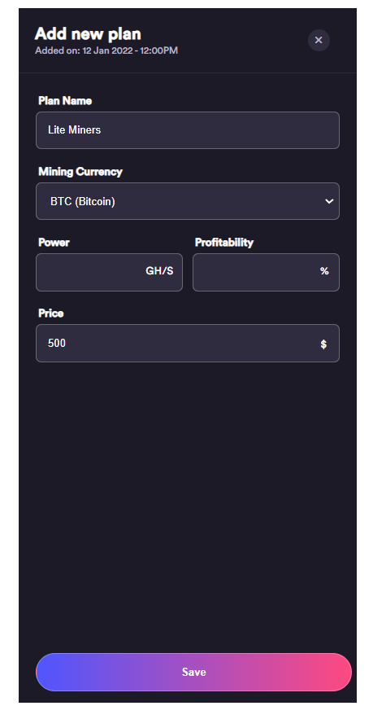
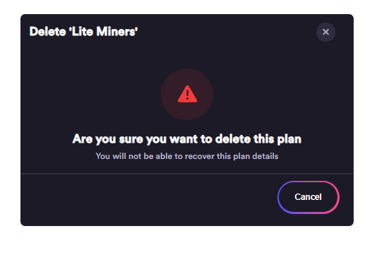
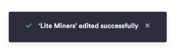
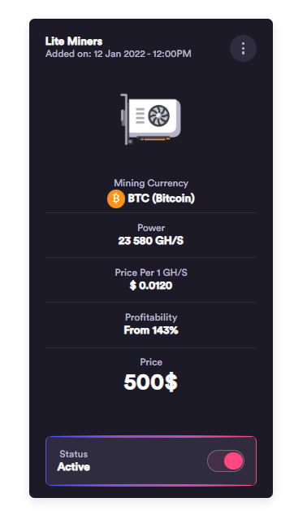
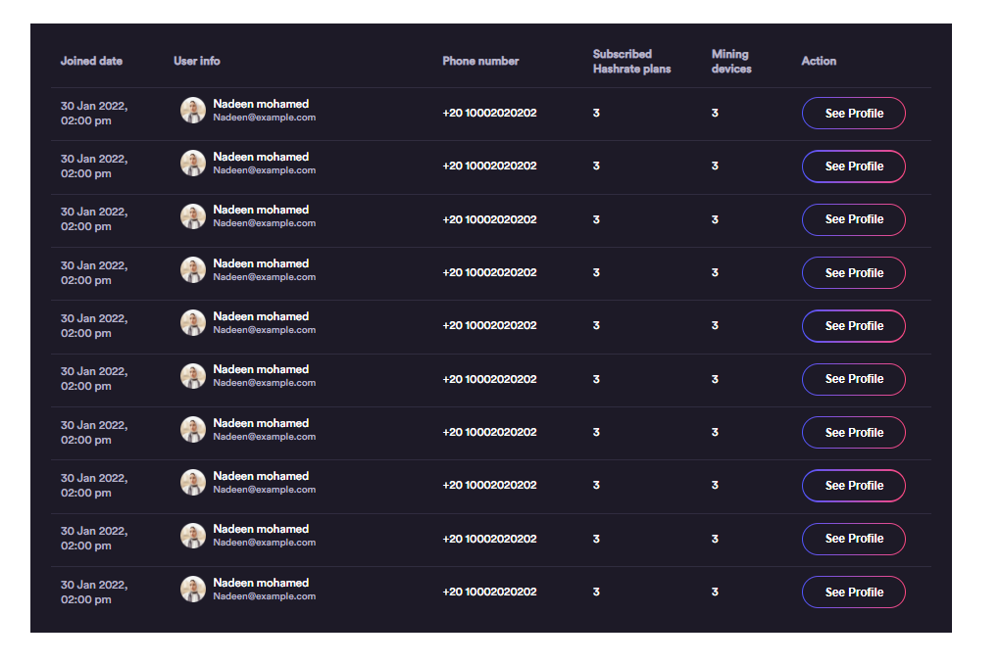
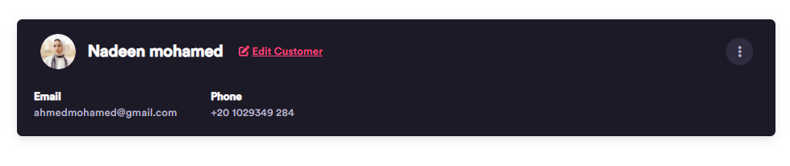

### EBitcoiner

A platform for cloud mining.

## My Responsibility

Converting a figma design of the **landing page** and some **dashboard components** into HTML and CSS.

# User Dashboard Components

**Miners**

# Admin Dashboard Components

**Add New**

**Delete Miner**

**Done Message**

**Plans**

**Subscribed Users**

**View Customers**

Rest of The Project

[Backend](https://github.com/at3f/hashStore)

[Admin Dashboard](https://github.com/Ahmedsk143/Admin-Dashboard)

[User Dashboard](https://github.com/Ahmedsk143/User-Dashboard)
